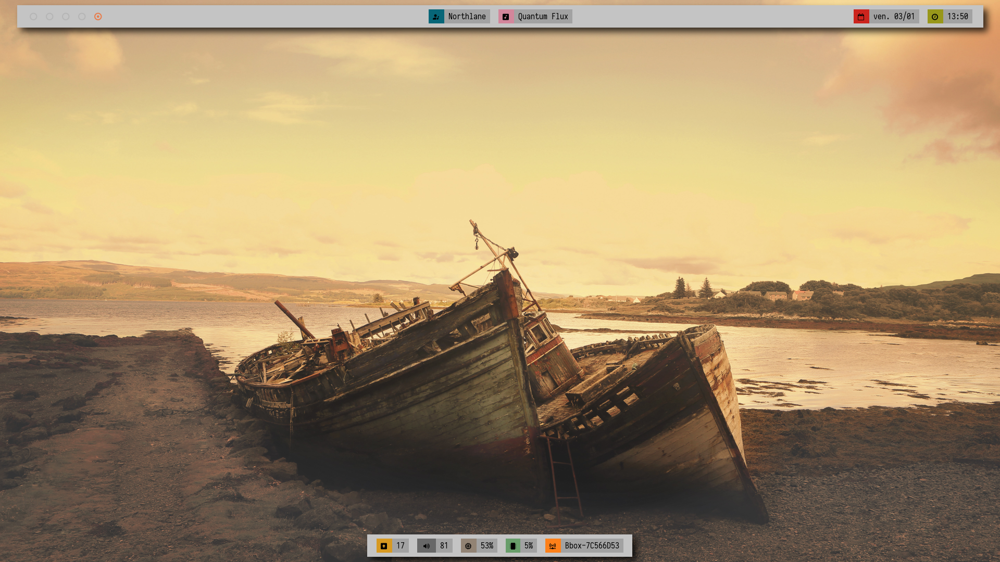

# Dotfiles



## config

- **wm**: i3-gaps
- **theme**: gruvbox
- **bar**: polybar
- **font**: Iosevka

## installation

You can use the `dotfile_manager.py` script.

### usage

    dotfile_manager.py --operation [save|deploy] [config_file]

Where:
- **save**: save config files, copy local config files to git repo
- **deploy**: copy config files to local host
- **config_file**: a `json` file telling where the config files should be saved/deployed

#### config json file

The `json` config must have the following code/syntax:

```json
{
    "path_to_git_file": "path_to_local_file",
    "git_dir": {
        "...": "...",
        "sub_dir": {
            "...": "..."
        }
    }
}
```

Each `sub_dir` is relative to the parent directory.